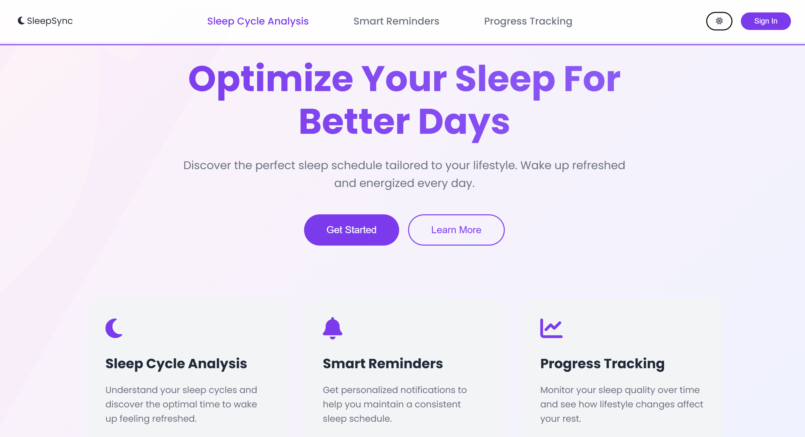
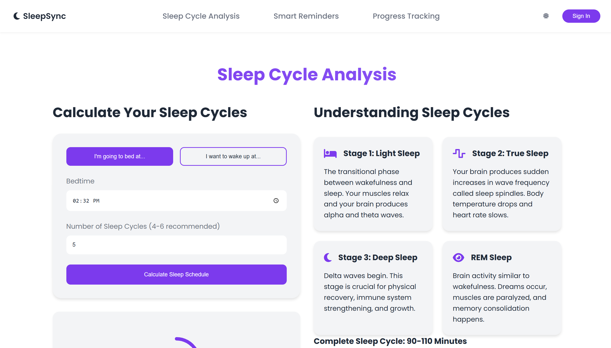
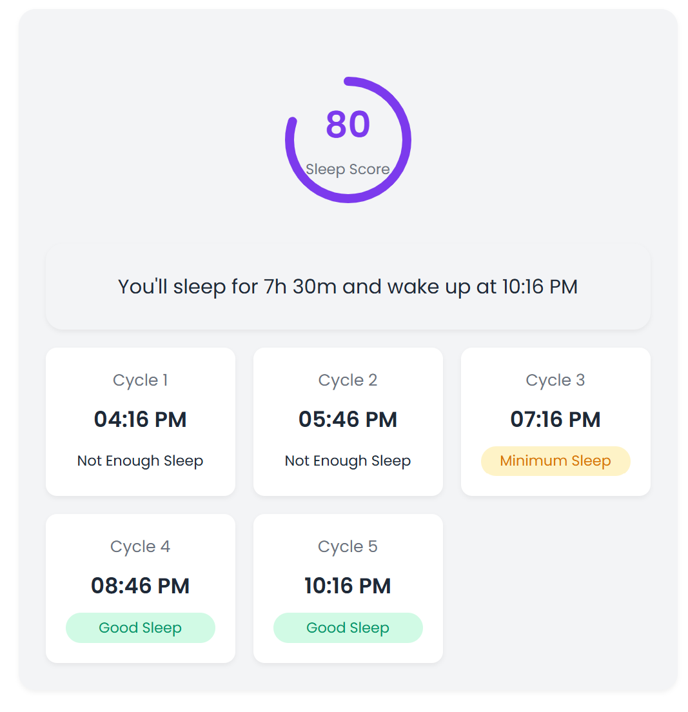
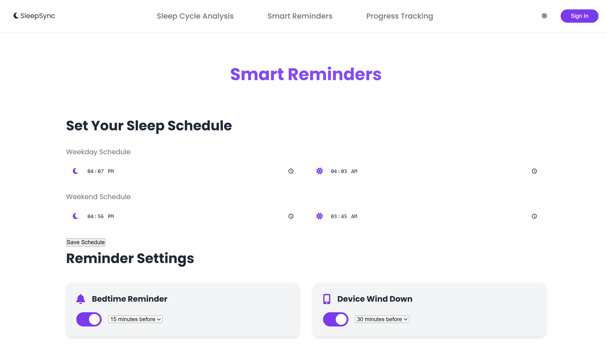
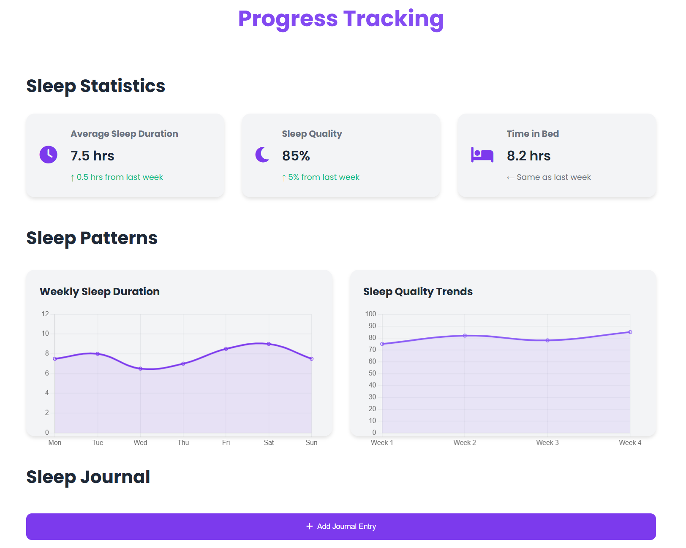

# SleepSync



> Optimize your sleep schedule for better days, every day.

SleepSync is a comprehensive web application designed to help users understand and improve their sleep patterns through science-backed recommendations, smart integrations, and personalized tracking.

## ✨ Features

### 🌙 Sleep Cycle Analysis
Understand your unique sleep cycles and discover the optimal times to fall asleep and wake up. Our algorithm analyzes your patterns to recommend schedules that leave you feeling refreshed.




### 🔔 Smart Reminders
Never miss your ideal bedtime again. Receive personalized notifications that adapt to your lifestyle and help you maintain a consistent sleep schedule.



### 📈 Progress Tracking
Track your sleep quality metrics over time and visualize how lifestyle changes affect your rest. Identify trends and make data-driven decisions to improve your sleep.



---

## 🚀 Getting Started

### Prerequisites
- Modern web browser
- Device with internet connection

### Installation
1. Clone the repository:
   ```
   git clone https://github.com/yourusername/sleepsync.git
   ```
2. Navigate to the project directory:
   ```
   cd sleepsync
   ```
3. Open `index.html` in your browser or set up a local server.

---

## 🛠️ Technology Stack

- HTML5/CSS3 for responsive interface
- JavaScript for interactive features
- Font Awesome for iconography
- Chart.js for data visualization
- Poppins font family for typography

---

## 🎨 Customization

#### Theme Toggling
SleepSync comes with both light and dark modes. Users can toggle between themes using the sun/moon icon in the navigation bar.

#### Responsive Design
The application is fully responsive and optimized for all device sizes from mobile to desktop.

---

## 📱 App Sections

- **Home**: Introduction to SleepSync and its core features
- **Sleep Cycle Analysis**: Detailed sleep pattern analysis tools
- **Smart Reminders**: Configure personalized sleep schedule notifications
- **Progress Tracking**: Visualize sleep data and improvement over time

---

## 🧠 Science-Backed Approach

Our recommendations are based on established sleep science research and circadian rhythm studies. We incorporate principles from:
- Sleep cycle duration research
- Chronobiology studies
- Cognitive performance optimization

---

## 🤝 Contributing

Contributions are welcome! Please feel free to submit a Pull Request.

1. Fork the repository
2. Create your feature branch (`git checkout -b feature/amazing-feature`)
3. Commit your changes (`git commit -m 'Add some amazing feature'`)
4. Push to the branch (`git push origin feature/amazing-feature`)
5. Open a Pull Request

---

## 🔥 Let's Connect!

For more information or to get involved in the project, feel free to reach out! Your contributions are welcome.
